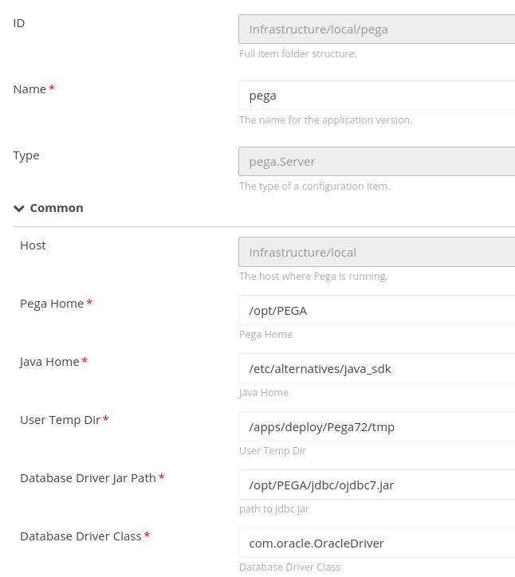
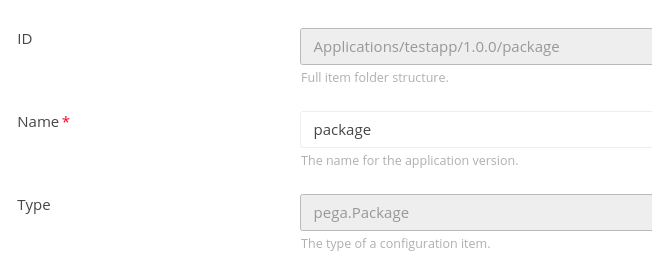
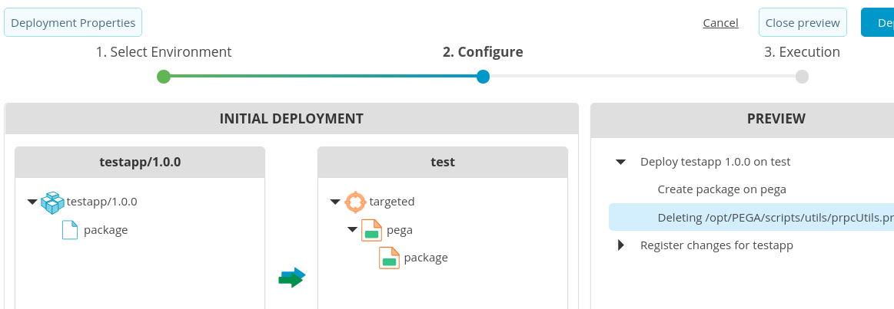
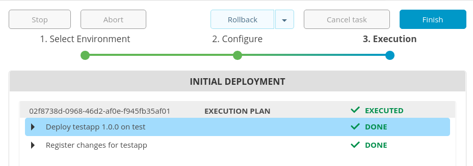

# xld-pega-plugin

# Preface #

This document describes the functionality provided by the XLD Pega plugin.

See the **XL Deploy Reference Manual** for background information on XL Deploy and deployment concepts.

# CI status #

[![Build Status][xld-pega-plugin-travis-image]][xld-pega-plugin-travis-url]
[![Codacy Badge][xld-pega-plugin-codacy-image] ][xld-pega-plugin-codacy-url]
[![Code Climate][xld-pega-plugin-code-climate-image] ][xld-pega-plugin-code-climate-url]
[![License: MIT][xld-pega-plugin-license-image] ][xld-pega-plugin-license-url]
[![Github All Releases][xld-pega-plugin-downloads-image] ]()

[xld-pega-plugin-travis-image]: https://travis-ci.org/xebialabs-community/xld-pega-plugin.svg?branch=master
[xld-pega-plugin-travis-url]: https://travis-ci.org/xebialabs-community/xld-pega-plugin
[xld-pega-plugin-codacy-image]: https://api.codacy.com/project/badge/Grade/4d86a381136c43ad8c87bfb1a267bd62
[xld-pega-plugin-codacy-url]: https://www.codacy.com/app/joris-dewinne/xld-pega-plugin
[xld-pega-plugin-code-climate-image]: https://codeclimate.com/github/xebialabs-community/xld-pega-plugin/badges/gpa.svg
[xld-pega-plugin-code-climate-url]: https://codeclimate.com/github/xebialabs-community/xld-pega-plugin
[xld-pega-plugin-license-image]: https://img.shields.io/badge/License-MIT-yellow.svg
[xld-pega-plugin-license-url]: https://opensource.org/licenses/MIT
[xld-pega-plugin-downloads-image]: https://img.shields.io/github/downloads/xebialabs-community/xld-pega-plugin/total.svg

# Overview #

This XLD Pega plugin is capable of installing PEGA exports (NOT uninstalling!) through the vendor-provided prpcUtils that features an import job. The artifact being imported is a JAR which PEGA code that has been exported from a different PEGA environment.

See vendor documentation for details on the export / import jobs.

# Requirements #

* **Requirements**
	* **XL Deploy** 5.5.0+

# Installation #

Place the plugin jar file (found on the 'releases' tab above) into your `SERVER_HOME/plugins` directory.

# Usage #

Please read the **XL Deploy Reference Manual** first if you're unfamiliar with XL Deploy. This plugin follows common XL Deploy deployments steps.

## Properties defined on the pega.Server type

## Properties defined on the deployable (database username and password fields can be used to override the values set on the container, a common pattern in XL Deploy)

## Example of output when preparing a deploy

 
## Example of output when doing a deployment

# Future work #
Document synthetic properties as this plugin proves itself.

# Implementation notes #

Files of importance:

- [custom type definitions](src/main/resources/synthetic.xml)
- [template for prpcUtils input](src/main/resources/pega/prpcUtils.properties)
- [installation script template](src/main/resources/pega/install.sh.ftl)
